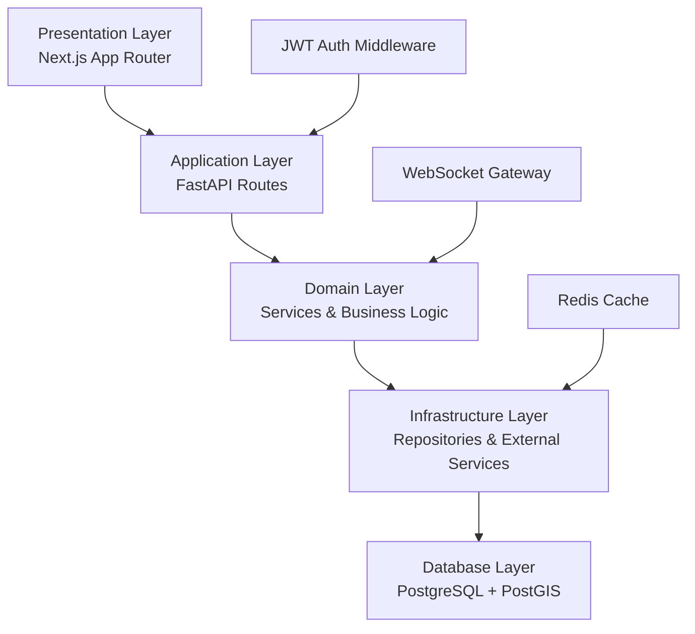
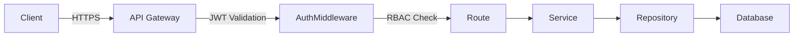
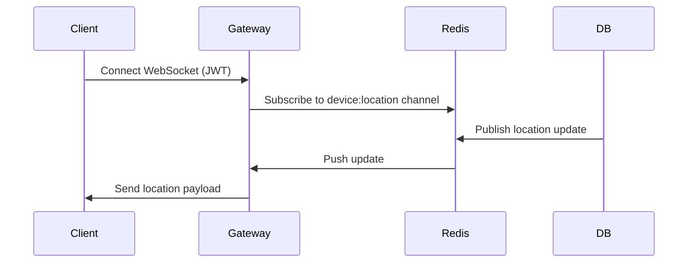

# Architecture

## Overview

GeoTrack Enterprise follows a **layered architecture** with strict separation of concerns. Each layer has a single responsibility and depends only on the layer directly below it.



## Frontend Architecture

### Layer Breakdown

| Layer            | Responsibility                                      |
| ---------------- | --------------------------------------------------- |
| **Pages**        | Route-level components, layout composition          |
| **Components**   | Reusable UI primitives, feature components          |
| **Hooks**        | Data fetching, side effects, stateful logic         |
| **Stores**       | Global client state (auth, UI, preferences)         |
| **Types**        | Shared TypeScript types and interfaces              |
| **Lib**          | API client, utilities, constants                    |

### State Management

- **Zustand** — Global client state (auth session, UI state)
- **TanStack Query** — Server state, caching, optimistic updates
- **React Hook Form + Zod** — Form state and validation

### Design System

- **Tailwind CSS** with CSS custom properties for theming
- **shadcn/ui** component library built on Radix UI primitives
- Dark mode and light mode via `next-themes`
- 8px spacing system, consistent color ramps (primary, secondary, accent, success, warning, error)
- Framer Motion for page transitions and micro-interactions

## Backend Architecture

### Layer Breakdown

| Layer               | Responsibility                                      |
| ------------------- | --------------------------------------------------- |
| **Presentation**    | FastAPI routes, request parsing, response shaping   |
| **Application**     | Use cases, orchestration, DTO mapping                |
| **Domain**          | Business logic, domain models, rules                 |
| **Infrastructure**  | Database access, external APIs, caching              |
| **Database**        | PostgreSQL + PostGIS, migrations via Alembic         |

### Module Independence

Each feature module (auth, devices, trips, geofences, alerts, analytics) is self-contained:

```
app/
├── modules/
│   ├── auth/
│   │   ├── router.py
│   │   ├── service.py
│   │   ├── repository.py
│   │   ├── models.py
│   │   └── schemas.py
│   ├── devices/
│   └── ...
```

### Dependency Injection

FastAPI's built-in DI container is used throughout:

- Database sessions injected via `Depends(get_db)`
- Service classes receive repositories as constructor arguments
- Configuration injected via `Settings` singleton

## Security Architecture



- **JWT** — Access tokens (30 min) + refresh tokens (7 days)
- **RBAC** — Role-based access control with 5 roles
- **Rate Limiting** — Redis-backed per-user and per-IP limits
- **Input Validation** — Pydantic v2 schemas on every endpoint
- **SQL Injection Protection** — SQLAlchemy parameterized queries
- **XSS/CSRF Protection** — Secure headers, CORS configuration

## WebSocket Architecture



## Testing Strategy

| Type            | Scope                                    |
| --------------- | ---------------------------------------- |
| **Unit**        | Services, domain logic, utilities       |
| **Integration** | Repository + database, API routes        |
| **API**         | End-to-end HTTP tests with httpx         |
| **WebSocket**   | Real-time connection and message tests  |
