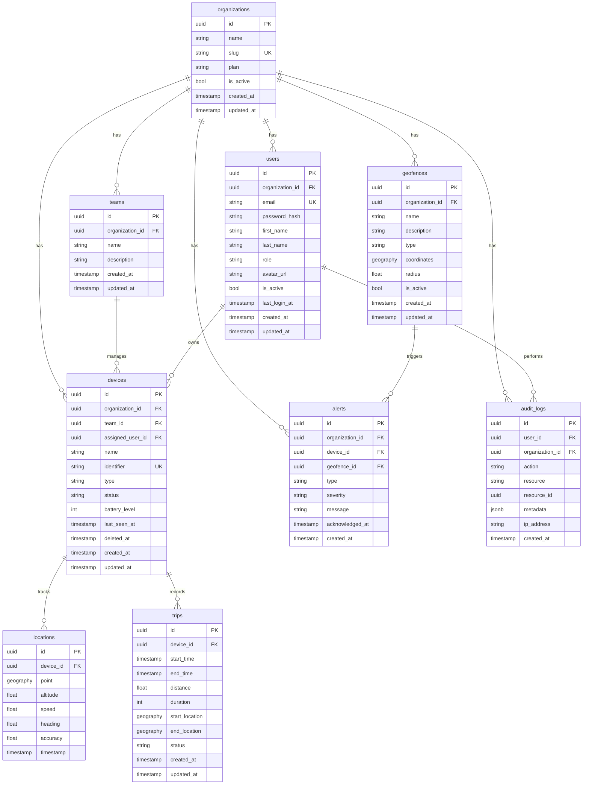

# Database Schema

## Overview

GeoTrack Enterprise uses PostgreSQL 16 with the PostGIS extension for geospatial data. All tables use UUID primary keys, audit timestamps (`created_at`, `updated_at`), and soft delete (`deleted_at`) where appropriate.

## ER Diagram

## Indexes

| Table      | Index                              | Type   |
| ---------- | ---------------------------------- | ------ |
| users      | `idx_users_email`                  | btree  |
| users      | `idx_users_organization_id`        | btree  |
| devices    | `idx_devices_organization_id`      | btree  |
| devices    | `idx_devices_identifier`           | btree  |
| devices    | `idx_devices_team_id`              | btree  |
| locations  | `idx_locations_device_id`          | btree  |
| locations  | `idx_locations_device_timestamp`   | btree  |
| locations  | `idx_locations_point`              | GIST   |
| trips      | `idx_trips_device_id`              | btree  |
| trips      | `idx_trips_status`                 | btree  |
| geofences  | `idx_geofences_organization_id`    | btree  |
| geofences  | `idx_geofences_coordinates`        | GIST   |
| alerts     | `idx_alerts_organization_id`       | btree  |
| alerts     | `idx_alerts_created_at`            | btree  |
| audit_logs | `idx_audit_logs_user_id`           | btree  |
| audit_logs | `idx_audit_logs_created_at`         | btree  |

## Constraints

- **UNIQUE**: `users.email`, `devices.identifier`, `organizations.slug`
- **CHECK**: `devices.type IN ('vehicle', 'asset', 'person')`
- **CHECK**: `users.role IN ('super_admin', 'admin', 'manager', 'operator', 'viewer')`
- **FOREIGN KEY**: All inter-table relationships with `ON DELETE CASCADE` or `ON DELETE SET NULL` as appropriate

## PostGIS Usage

- `locations.point` — `GEOGRAPHY(Point, 4326)` for WGS84 coordinates
- `geofences.coordinates` — `GEOGRAPHY(Polygon, 4326)` for polygon geofences
- Spatial queries use `ST_DWithin`, `ST_Contains`, `ST_Distance` for proximity and containment checks
